## 🧠 EMNIST Character Recognition App

Draw a handwritten character using your mouse, and let a deep learning model predict it in real-time!
This app uses a PyTorch-trained neural network on the EMNIST dataset and a Tkinter interface for an intuitive user experience.

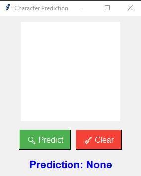
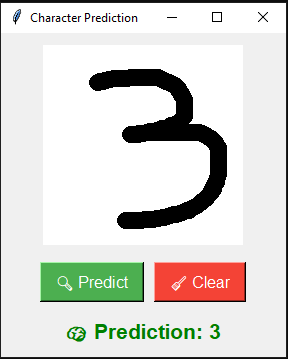

---

### 📦 Features

* 🖌️ Freehand drawing canvas (Tkinter-based)
* 🔍 Real-time character prediction using a pre-trained PyTorch model
* 🌗 Image preprocessing (resize, invert, rotate, flip)
* ✅ Custom-styled buttons and predictions in color
* 💡 Supports EMNIST (Extended MNIST) character set

---

### ⚙️ How It Works

1. **Drawing**: You draw a character (A-Z, 0-9, etc.) in the canvas using the mouse.
2. **Preprocessing**:

   * Resize to 28x28
   * Invert colors to match EMNIST style (white on black)
   * Apply flip and rotation to align with EMNIST orientation

3. **Model Prediction**: The processed image is passed to a PyTorch model.
4. **Display Result**: The predicted class (e.g., "A", "3", "Z") is displayed clearly below the buttons.

---

### 🖼️ Screenshots

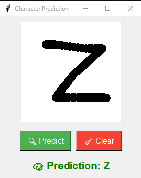
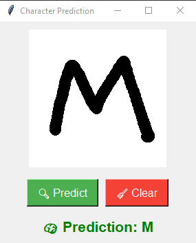
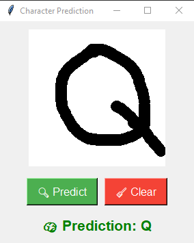
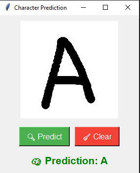

---

### 📥 Installation

1. **Clone the repo**:

   ```bash
   git clone git@github.com:drisskhattabi6/EMNIST-Character-Recognition-App.git
   cd EMNIST-Character-Recognition-App
   ```

2. **Install dependencies**:

   ```bash
   pip install -r requirements.txt
   ```
---

### 🚀 Running the App

```bash
python app.py
```

* 🖌️ Draw a character.
* 🔍 Click `Predict` to see the result.
* 🧹 Click `Clear` to reset the canvas.

---

### 🧠 Model Training 

If you want to train your own model on EMNIST:

go to `Notebook - EMNIST.ipynb` and run the notebook.

Make sure your model architecture and preprocessing match what the app expects (e.g., `F.hflip` + `F.rotate(90)`).

**Example of the dataset**:

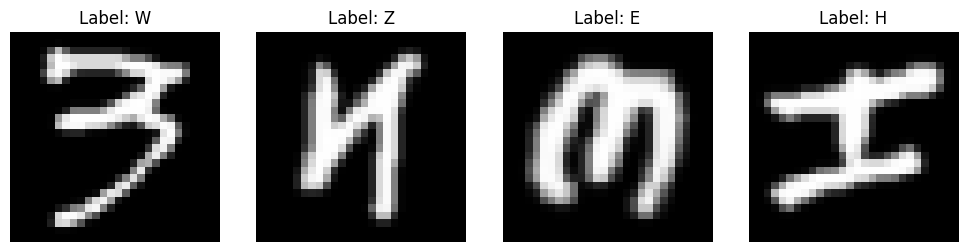
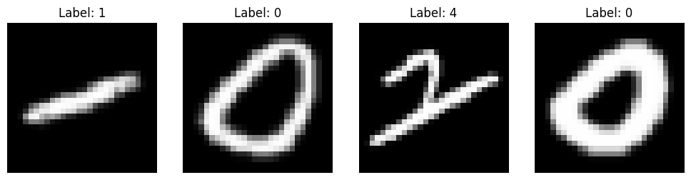

**Dataset Class Distribution**:

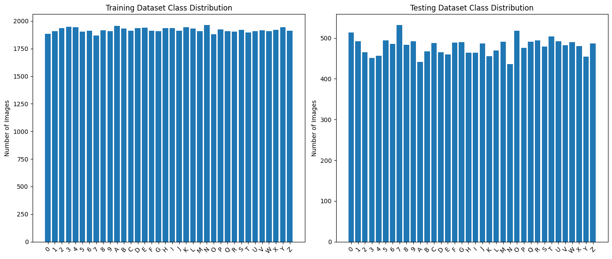

**Model Metrics I got**:

Accuracy: 0.89
Confusion Matrix:

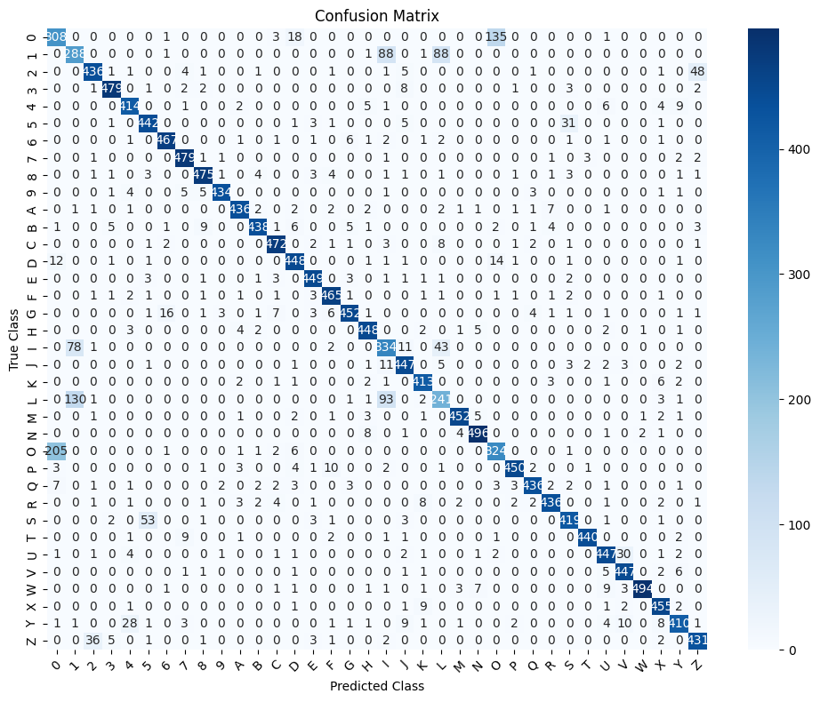

Classification Report:

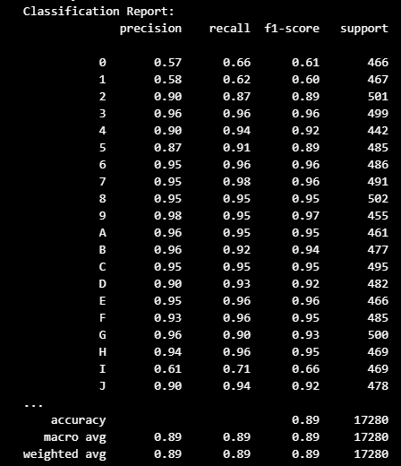

---

### 🗂️ File Structure

```
.
├── app.py                                # Main app file
├── emnist_cnn.pth                        # Trained PyTorch model
├── Build the Tkinter Interface.ipynb     # Tkinter interface notebook
├── Notebook - EMNIST.ipynb               # Model training notebook
├── imgs/                                 # Images folder
└── README.md                             # This file 
```

### 👨‍💻 Author

**Idriss**
MSc AI & Data Science | Django Developer | [LinkedIn](https://www.linkedin.com/in/idriss-khattabi-b3a266235/)
